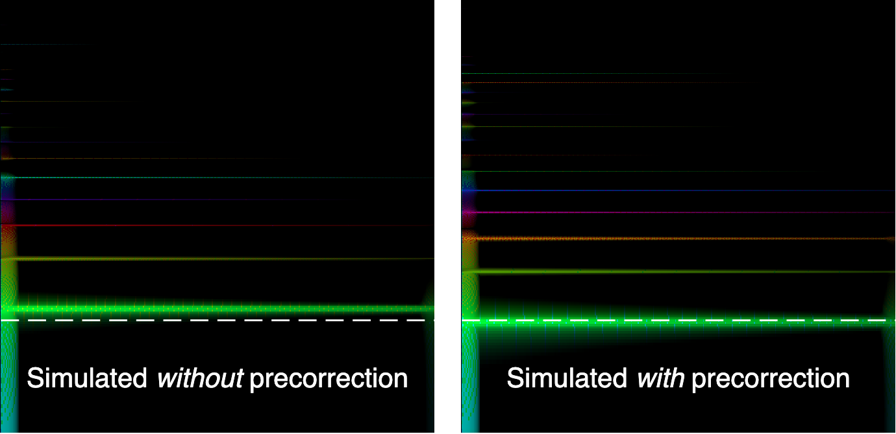

<p align="center">

<br>
Simulated string with bowing excitation, exhibiting a Helmholtz motion.
</p>

----

This repo contains two PyTorch-based string simulator, namely
*StringFDTD-Torch* [[1]](#1) and *DMSP* [[2]](#2).

- StringFDTD-Torch [](https://arxiv.org/abs/2311.18505)
- DMSP [](https://openreview.net/forum?id=fpxRpPbF1t) [](https://huggingface.co/spaces/szin94/dmsp)

*StringFDTD-Torch* is a planar string simulation engine
for musical instrument sound synthesis research.
It simulates a string vibration from a given set
of mechanical properties and excitation conditions
based on a finite difference scheme
(i.e., finite difference time domain)
and outputs the resulting string sound.

*Differentiable Modal Synthesis for Physical Modeling (DMSP)*
is a neural network trained to approximate the string motion
simulated using StringFDTD-Torch but in an efficient manner
augmenting the modal synthesis method in a similar manner to
the DDSP approach.  

## Usage
We encourage you to set `task.root_dir=` argument
to the path you wish to save the simulation results.
You can also set this by modifying `src/configs/config.yaml` as follows.
```yaml
task:
  root_dir: '/path/to/save/results'
```
Everything you simulate will be saved under `/path/to/save/results/{{ task.result_dir }}` directory.

### Dependencies
Install python and system dependencies 
```bash
xargs apt-get install < requirements.sys
pip install -r requirements.txt
```

### Run the string simulator
StringFDTD-Torch can simulate under your own
predefined configurations or can also be used
as a dataset generator by randomly augmenting
within a set of bounds for the mechanical conditions.
It can also simulate on the CPU or GPU,
depending on the state of the device you want to simulate.
You may want to pick CPU if you are
simulating your own configuration in a small batch size.
However, it is recommended to use GPU for simulating
as a dataset generator with large batch size,
to benefit from the GPU parallelism.

#### Running as a dataset generator
StringFDTD-Torch can simulate the string under various conditions.
The configuration can be specified by passing arguments or
by defining them in a `.yaml` file (or using both of them.)
We have prepared a typical example configuration in
`src/configs/experiment/nsynth-like.yaml`.
The `nsynth-like.yaml` predefines the configurations for
generating sound samples akin to NSynth [[4]](#4).
It can be run as follows.
```bash
python -m run experiment=nsynth-like task.result_dir=my_simulation
```

#### Running with a specified conditions
In order to provide specific conditions
(such as predefined F0, bowing force, hammering timing, etc.)
save them as `/path/to/preset/*.npy` file.
Passing `task.load_config=/path/to/preset` will load
the preset parameters for simulation.
The other parameters, those are not defined in
`/path/to/preset`, will be randomly augmented.
You can also specify the augmentation range
using the `experiment` argument as follows.
```bash
python -m run experiment=nsynth-like task.excitation=hammer task.load_config=data/trumpet
```

### Devices
StringFDTD-Torch uses GPUs by default.
In order to simulate using CPUs, set `proc.cpu=true`.
You might need to `export CUDA_VISIBLE_DEVICES=""` in your bash script.
A typical usage example, along with specifying the processors via taskset,
would appear like this.

```bash
taskset -c 16-31 python -m run proc.cpu=true ...
```


### Debug
You can run the simulation in a debug mode by passing `task.result_dir=debug`.
```bash
python -m run experiment=my_experiment task.result_dir=debug
```

### Fundamental frequency pre-correction
In the string instrument simulation, the pitch (or the fundamental frequency) of the sound can vary depending on the stiffness of the string.  While pitch changes with stiffness have been and continue to be studied for a long time, we have found that the amount of detune in the simulated sounds closely matches the theoretical model proposed by Fletcher [[3]](#3). And even if detune is a natural phenomenon, we provide the ability to pre-correct the pitch based on the theoretical model to achieve the sound at the intended pitch.

<p align="center">

</p>

As the spectrograms above show, without the precorrection, there is a bit of detune in the intended fundamental frequency (white dashed lines) and the estimated one. However, the detune is resolved by pre-correcting the input fundamental frequency. Utilizing the pre-correction feature significantly reduces the detune phenomenon, but at the cost of a relatively large increase in computation and speed. So, if you think this pre-correction is not necessary, you can turn off pre-correction by passing `task.precorrect=false` argument. Please note that this argument is set `true` by default.

```bash
python -m run  ... task.precorrect=false
```

### Evaluate or plot the simulated results
You can evaluate or plot the simulation results by passing `experiment=evaluate`.
Please specify the path to the directory that contains the simulation results.
```bash
ls /path/to/simulated/directory # 0-0  0-1  ...  codes  run.log
python -m run experiment=evaluate task.load_dir='/path/to/simulated/directory/' 
```


## Citation

If you use this simulator in your research, please cite the following paper.

```bib
@inproceedings{leedifferentiable,
  title     = {Differentiable Modal Synthesis for Physical Modeling of Planar String Sound and Motion Simulation},
  author    = {Lee, Jin Woo and Park, Jaehyun and Choi, Min Jun and Lee, Kyogu},
  booktitle = {The Thirty-eighth Annual Conference on Neural Information Processing Systems (NeurIPS)},
  year      = {2024}
}
@inproceedings{lee2024string,
  title        = {String Sound Synthesize on GPU-accelerated Finite Difference Scheme},
  author       = {Lee, Jin Woo and Choi, Min Jun and Lee, Kyogu},
  booktitle    = {ICASSP 2024-2024 IEEE International Conference on Acoustics, Speech and Signal Processing (ICASSP)},
  pages        = {1--5},
  year         = {2024},
  organization = {IEEE}
}
```

## References
<a id="1">[1]</a> 
Lee, J. W., Choi, M. J., & Lee, K. (2024, April).
String Sound Synthesizer On Gpu-Accelerated Finite Difference Scheme.
In *ICASSP 2024-2024 IEEE International Conference on Acoustics, Speech and Signal Processing (ICASSP)* (pp. 1491-1495). IEEE.

<a id="2">[2]</a> 
Lee, J. W., Park, J., Choi, M. J., & Lee, K. (2024).
Differentiable Modal Synthesis for Physical Modeling of Planar String Sound and Motion Simulation.
In *The Thirty-eighth Annual Conference on Neural Information Processing Systems (NeurIPS)*.

<a id="3">[3]</a> 
Fletcher, H. (1964).
Normal vibration frequencies of a stiff piano string.
*The Journal of the Acoustical Society of America*, 36(1), 203-209.

<a id="4">[4]</a> 
Engel, J., Resnick, C., Roberts, A., Dieleman, S., Norouzi, M., Eck, D., & Simonyan, K. (2017, July).
Neural audio synthesis of musical notes with wavenet autoencoders.
In *International Conference on Machine Learning* (pp. 1068-1077). PMLR.


